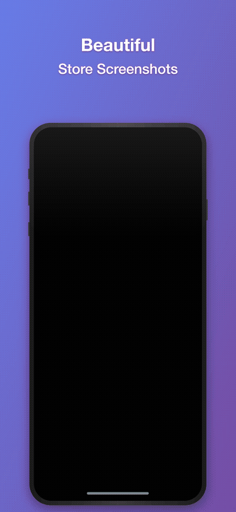

# Store Screenshot Generator MCP

Generate beautiful App Store / Play Store screenshots with iPhone mockups using Claude Code.



## Features

- Insert app screenshots into iPhone/iPad mockup frames
- Add headline and subheadline text overlays
- Multiple gradient background presets
- Support for iPhone 15 Pro Max, iPhone 15 Pro, iPhone SE, iPad Pro
- Batch generation support

## Pricing

| Plan | Price | Features |
|------|-------|----------|
| Free | $0 | 3/day, watermark, limited presets/devices |
| **Pro** | **$4.9/mo** | Unlimited, no watermark, all features |

**[Subscribe to Pro](https://8566730725923.gumroad.com/l/bkkfx)**

### Free vs Pro

| Feature | Free | Pro |
|---------|------|-----|
| Daily screenshots | 3 | Unlimited |
| Watermark | Yes | No |
| Presets | purple, dark | All 7 |
| Devices | iPhone 15 Pro Max | All 7 (3 iPhones + 4 iPads) |
| Batch generation | No | Yes |
| Custom colors | No | Yes |

## Installation

```bash
npm install
npm run build
```

### Usage with Claude Code

Add to your project's `.mcp.json`:

```json
{
  "mcpServers": {
    "store-screenshot": {
      "command": "node",
      "args": ["/path/to/store-screenshot-mcp/dist/index.js"]
    }
  }
}
```

Or for global setup, add to `~/.claude/settings.json`:

```json
{
  "mcpServers": {
    "store-screenshot": {
      "command": "node",
      "args": ["/path/to/store-screenshot-mcp/dist/index.js"]
    }
  }
}
```

### Usage with Claude Desktop

Add to `~/Library/Application Support/Claude/claude_desktop_config.json` (macOS) or `%APPDATA%\Claude\claude_desktop_config.json` (Windows):

```json
{
  "mcpServers": {
    "store-screenshot": {
      "command": "node",
      "args": ["/path/to/store-screenshot-mcp/dist/index.js"]
    }
  }
}
```

## Available Tools

### generate_screenshot

Generate a single screenshot.

**Parameters:**
- `headline` (optional): First line text
- `subheadline` (optional): Second line text
- `screenshotPath` (optional): Path to app screenshot image
- `screenshotBase64` (optional): Base64 encoded app screenshot
- `outputPath` (optional): Output file path
- `device` (optional): Device type
- `preset` (optional): Color preset
- `bgColor1`, `bgColor2` (optional): Custom gradient colors (Pro)

### generate_batch_screenshots

Generate multiple screenshots at once. (Pro)

### subscription_status

Check current subscription status and usage.

### activate_subscription

Activate Pro subscription.

```
activate_subscription(email="your_purchase_email")
```

### refresh_subscription

Refresh subscription status from server. Reflects cancellation immediately.

### deactivate_subscription

Deactivate subscription on this device.

### list_presets / list_devices

List available presets/devices for your plan.

## Color Presets

| Preset | Color 1 | Color 2 | Plan |
|--------|---------|---------|------|
| purple | #667eea | #764ba2 | Free |
| dark   | #232526 | #414345 | Free |
| pink   | #f093fb | #f5576c | Pro |
| blue   | #4facfe | #00f2fe | Pro |
| green  | #43e97b | #38f9d7 | Pro |
| orange | #fa709a | #fee140 | Pro |
| light  | #e0e5ec | #f5f7fa | Pro |

## Device Dimensions

| Device | Resolution | Plan |
|--------|------------|------|
| iPhone 15 Pro Max | 1290 x 2796 | Free |
| iPhone 15 Pro | 1179 x 2556 | Pro |
| iPhone SE | 750 x 1334 | Pro |
| iPad Pro 12.9" | 2048 x 2732 | Pro |
| iPad Pro 11" | 1668 x 2388 | Pro |
| iPad Air | 1640 x 2360 | Pro |
| iPad Mini | 1488 x 2266 | Pro |

## Usage Example

```
# Check subscription status
subscription_status

# Activate Pro
activate_subscription(email="your@email.com")

# Generate screenshot
generate_screenshot(
  headline="Easy & Fast",
  subheadline="Task Management",
  screenshotPath="/path/to/app_screen.png",
  outputPath="/path/to/output.png",
  preset="purple"
)
```

## License

MIT
